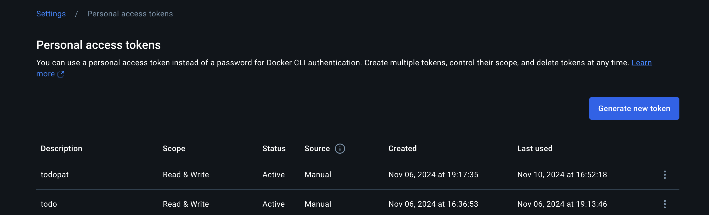

# continuos integration

- create an ec2 instance with jenkins and docker installed, edit inbound rules for jenkins port 8080 open
- vist http://<public_url_instance>:8080
- connect the instance with ssh-agent and sudo cat /var/lib/jenkins/initialAdminPassword
- it will output password and enter the password to jenkins ui and create users and install plugins and jenkins ready
- install generic-web-hook-trigger and google-chat-notification plugin and restart the jenkins
- create personal access token of github and docker hub and url for google chat notification from github, docker hub and google-chat-notification
- use these personal access token and url for adding jenkins credentials
- In the github repo create an jenkins file after the pull request from dev to main will trigger mern-todo-app pipeline in which git clone from the github, checkout docker image build, and then push the images to dockerhub and picks the image tag from the image name which is a parameter for the second pipeline. trigger the second pipeline pass the image tag to second pipeline
- in github settings add webhook of generic-webhook-trigger with the jenkins ec2 instance in which jenkins is installed.
- create another github repo consisting of docker-compose file and k8s deployment files and in that file create an jenkins file. which receives the image tag as a parameter, git clone and checkout the k8s files to change newest received image tag and docker-compose file to change the tag of the image tag from the docker-compose file. run the docker-compose environments and sends the message to google-chat-notification app that the build is completed with the new image
- after merge the pull request from dev to main it will trigger the first pipeline and after successful build from it will trigger the second pipeline

Here's a step-by-step guide for setting up Jenkins with Docker, configuring webhooks, and triggering CI/CD pipelines in a GitHub and Docker Hub environment. This example assumes you have a basic understanding of AWS, Jenkins, Docker, Kubernetes, and GitHub.

### README.md

````markdown
# Jenkins CI/CD Pipeline for MERN Todo App

This document outlines the process for setting up a Jenkins instance on an AWS EC2 instance, configuring Jenkins with Docker and GitHub, and triggering two CI/CD pipelines for building and deploying the MERN stack application. The entire pipeline integrates GitHub, Docker Hub, and Google Chat notifications.

---

## 1. **Create EC2 Instance and Install Jenkins with Docker**

1. **Launch EC2 Instance**

   - Create an EC2 instance with an Ubuntu-based AMI (e.g., `ubuntu-20.04`).
   - Ensure that the instance has sufficient resources (e.g., t2.medium or above for Jenkins and Docker).

2. **SSH into the EC2 Instance**
   ```bash
   ssh -i your-key.pem ubuntu@<public-ip-address>
   ```
````

3. **Install Jenkins and Docker**  
   Run the following commands to install Jenkins and Docker:

   ```bash
   # Install Docker
   sudo apt-get update
   sudo apt-get install -y docker.io
   sudo systemctl start docker
   sudo systemctl enable docker

   # Install Jenkins
   sudo apt install openjdk-11-jdk
   wget -q -O - https://pkg.jenkins.io/jenkins.io.key | sudo apt-key add -
   sudo sh -c 'echo deb http://pkg.jenkins.io/debian/ / > /etc/apt/sources.list.d/jenkins.list'
   sudo apt update
   sudo apt install jenkins

   # Start Jenkins
   sudo systemctl start jenkins
   sudo systemctl enable jenkins
   ```

---

## 2. **Edit Inbound Rules for Jenkins Port (8080)**

1. Open the **Security Groups** settings for your EC2 instance.
2. Add an inbound rule to allow traffic on port `8080`:
   - **Type**: Custom TCP
   - **Port Range**: 8080
   - **Source**: Anywhere (0.0.0.0/0) or restrict to your IP.

---

## 3. **Access Jenkins UI**

1. Open your browser and visit Jenkins at:

   ```
   http://<public-ip-address>:8080
   ```

2. **Retrieve Jenkins Admin Password**  
   To get the Jenkins admin password, SSH into your EC2 instance and run:

   ```bash
   sudo cat /var/lib/jenkins/initialAdminPassword
   ```

   This will output the password for Jenkins UI.

3. **Complete Initial Setup**
   - Enter the password in the Jenkins setup page.
   - Create an admin user.
   - Install the recommended plugins.

---

## 4. **Install Required Jenkins Plugins**

1. Go to **Manage Jenkins > Manage Plugins**.
2. Install the following plugins:

   - **Generic Webhook Trigger Plugin**
   - **Google Chat Notifications Plugin**

3. **Restart Jenkins** to apply the changes.

---

## 5. **Create Personal Access Tokens**

You will need personal access tokens for **GitHub**, **Docker Hub**, and **Google Chat**.


1. **GitHub**:

   - Go to [GitHub Personal Access Tokens](https://github.com/settings/tokens).
   - Generate a token with repo and webhook permissions.

2. **Docker Hub**:

   - Log in to Docker Hub.
   - Navigate to **Account Settings > Security** to generate a personal access token.

3. **Google Chat**:
   - Create a webhook URL for Google Chat following [this guide](https://developers.google.com/chat). This will be used to send notifications.

---

## 6. **Configure Jenkins Credentials**

1. Go to **Manage Jenkins > Manage Credentials**.
2. Add the following credentials:
   - **GitHub Token** (Name: `github-token`)
   - **Docker Hub Token** (Name: `dockerhub-token`)
   - **Google Chat Webhook URL** (Name: `google-chat-webhook`)

---

## 7. **Create Jenkinsfile for GitHub Repository**

In your **GitHub Repository** (e.g., `mern-todo-app`), create a `Jenkinsfile` in the root directory. This file defines the pipeline stages:

```groovy
pipeline {
    agent any
    parameters {
        string(name: 'IMAGE_TAG', defaultValue: 'latest', description: 'Docker image tag')
    }
    stages {
        stage('Clone Repo') {
            steps {
                git 'https://github.com/shashidas95/mern-todo-app.git'
            }
        }
        stage('Build Docker Image') {
            steps {
                script {
                    def dockerImage = docker.build("mern-todo-app:${params.IMAGE_TAG}")
                }
            }
        }
        stage('Push Docker Image') {
            steps {
                script {
                    docker.withRegistry('https://index.docker.io/v1/', 'dockerhub-token') {
                        dockerImage.push()
                    }
                }
            }
        }
        stage('Trigger Deployment Pipeline') {
            steps {
                script {
                    def webhookUrl = 'https://jenkins.example.com/generic-webhook-trigger/invoke'
                    sh "curl -X POST --data-urlencode 'payload={\"image_tag\":\"${params.IMAGE_TAG}\"}' ${webhookUrl}"
                }
            }
        }
    }
}
```

---

## 8. **Configure Webhook for Generic Webhook Trigger**

In your **GitHub Repository**:

1. Go to **Settings > Webhooks**.
2. Add a new webhook with the following settings:
   - **Payload URL**: `http://<public-ip-address>:8080/generic-webhook-trigger/invoke`
   - **Content Type**: `application/json`
   - **Triggers**: Choose **Pull Request** (dev to main).

---

## 9. **Create a Second GitHub Repository for Deployment**

Create another GitHub repository that includes Docker Compose and Kubernetes files. This repository will contain a `Jenkinsfile` for deploying the Docker image.

```groovy
pipeline {
    agent any
    parameters {
        string(name: 'IMAGE_TAG', defaultValue: 'latest', description: 'Docker image tag')
    }
    stages {
        stage('Clone Repo') {
            steps {
                git 'https://github.com/yourusername/deployment-repo.git'
            }
        }
        stage('Update Docker Compose and Kubernetes') {
            steps {
                script {
                    sh "sed -i 's/latest/${params.IMAGE_TAG}/g' docker-compose.yml"
                    sh "sed -i 's/latest/${params.IMAGE_TAG}/g' k8s/deployment.yaml"
                }
            }
        }
        stage('Run Docker Compose') {
            steps {
                sh 'docker-compose up -d'
            }
        }
        stage('Notify Google Chat') {
            steps {
                script {
                    def webhookUrl = 'https://chat.googleapis.com/v1/spaces/.../messages?key=...'
                    def message = "Build completed and deployed with image: ${params.IMAGE_TAG}"
                    sh "curl -X POST -H 'Content-Type: application/json' -d '{\"text\": \"${message}\"}' ${webhookUrl}"
                }
            }
        }
    }
}
```

---

## 10. **Trigger the CI/CD Pipeline**

1. **Pull Request Merge**  
   When a pull request is merged from `dev` to `main` in the **MERN Todo App** GitHub repository, it will trigger the first Jenkins pipeline, which will:

   - Clone the repo.
   - Build the Docker image.
   - Push the image to Docker Hub.
   - Trigger the second pipeline.

2. **Second Pipeline**  
   The second pipeline:
   - Pulls the latest Docker image.
   - Updates the Docker Compose and Kubernetes files with the new image tag.
   - Deploys the app using Docker Compose.
   - Sends a notification to Google Chat.

---

## 11. **Final Workflow**

- **Step 1**: Developer pushes code to `dev` branch.
- **Step 2**: Developer creates a pull request to merge `dev` into `main`.
- **Step 3**: The first Jenkins pipeline builds and pushes the Docker image to Docker Hub.
- **Step 4**: The second Jenkins pipeline updates Docker Compose and Kubernetes, runs the Docker container, and sends a notification to Google Chat.

---

## Resources

- [Jenkins Website](https://www.jenkins.io)
- [Docker Hub](https://hub.docker.com/)
- [Google Chat Webhooks](https://developers.google.com/chat)
- [GitHub Personal Access Tokens](https://github.com/settings/tokens)

---

## Screenshot


````

### Key Points:
1. **Jenkins Setup**: Installs Jenkins and Docker on an EC2 instance, configures Jenkins with necessary plugins, and sets up credentials for GitHub, Docker Hub, and Google Chat.
2. **CI/CD Pipeline**: Defines a `Jenkinsfile` for the build and deployment pipeline that involves cloning a GitHub repo, building and pushing Docker images, and triggering a second deployment pipeline.
3. **Webhooks**: Configures GitHub webhooks to trigger the Jenkins pipeline upon pull request merges.
4. **Deployment**: Automates deployment with Docker Compose and Kubernetes, and notifies Google Chat on completion.

In Markdown, you can add both **images** and **links** using simple syntax. Below are examples of how to do each:

### 1. **Linking an Image**

To link an image in Markdown, you use a combination of the image syntax and the link syntax. Here's the format:

```markdown
[]
````

- `alt text`: A description of the image, shown if the image can't be loaded.
- `image-url`: The URL or path to the image file.
- `link-url`: The URL you want to link to when the image is clicked.

#### Example:

[]

In this example:

- The image `mern-todo-app-screenshot.png` will be displayed.
- When the image is clicked, it will redirect to `https://example.com`.

### 2. **Linking Text**

To add a link to text in Markdown, use this syntax:

```markdown
[link text](URL)
```

- `link text`: The clickable text.
- `URL`: The destination URL.

#### Example:

```markdown
[Visit our Website](https://example.com)
```

This will display as:

- **[Visit our Website](https://example.com)**

### Putting Both Together

You can combine both an image and a text link in a single Markdown document:

```markdown
# Welcome to the MERN Todo App

Check out our [MERN Todo App screenshot](https://example.com/mern-todo-app-screenshot.png) below:

[](https://example.com)

For more information, visit [our website](https://example.com).
```

### Explanation:

- **Text Link**: `Check out our [MERN Todo App screenshot](https://example.com/mern-todo-app-screenshot.png)` will create a clickable text link to the image.
- **Image with Link**: `[](https://example.com)` will show the image and link it to the provided URL.
- **Plain Text Link**: `[our website](https://example.com)` creates a clickable text that links to the website.

---

### Final Example in Markdown:

```markdown
# MERN Todo App Setup

To view the setup and code repository, click on the image below:

[](https://example.com)

For more details, visit the full documentation on [our website](https://example.com).
```

This will render:

- An image of the MERN Todo App that is linked to `https://example.com`.
- A clickable text link "our website" that takes you to `https://example.com`.

Let me know if you need further clarification or help!
